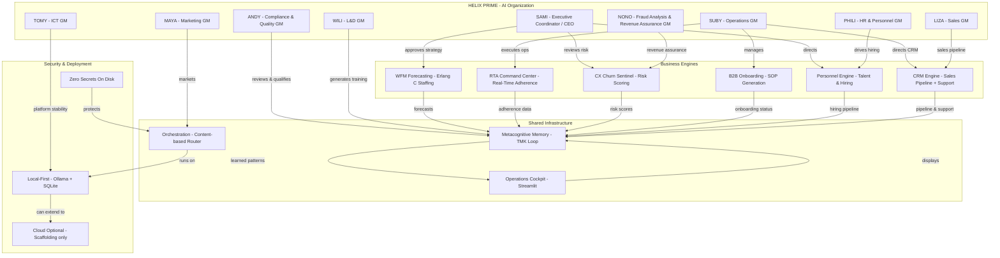

# Helix Prime — System Architecture

**An AI Organization.** Not a tool. Not a chatbot. Not a dashboard.

> **Engineers trust diagrams. Managers trust stories. Investors trust proof.**
> **Truth note:** This document was corrected against `MASTER_STORY.md`. Claims in
> earlier drafts about a "proof ledger" (57 entries), "every component runs today,"
> and a Flask webapp at port 5000 were fabricated or unverified and have been
> removed. Helix Prime is a **public alpha**; the architecture below reflects what
> exists in the repository, not what is proven to run end-to-end.

---

## One Diagram — The Helix Ecosystem

## How It Works — Plain Language

**Helix Prime** is a nine-member AI leadership team that directs six operational engines, running on shared infrastructure that learns over time.

### The Leadership Team
- **SAMI** — The CEO. Sets strategy, approves staffing decisions, owns the system's north star. Reviews churn risks and directs the personnel strategy.
- **SUBY** — The Operations GM. Runs real-time operations, monitors adherence, and manages client onboarding workflows.
- **PHILI** — The HR & Personnel GM. Owns talent acquisition, candidate scoring, and hiring pipeline management.
- **WILI** — The L&D GM. Creates training content and feeds lessons back into the system's memory.
- **MAYA** — The Marketing GM. Owns demand generation, market intelligence, and campaign management.
- **LIZA** — The Sales GM. Owns the sales pipeline, CRM operations, and proposal generation.
- **ANDY** — The Compliance & Quality GM. Reviews actions, qualifies results, and enforces segregation-of-duties rules.
- **TOMY** — The ICT GM. Owns platform operations, integration management, and reliability.
- **NONO** — The Fraud Analysis & Revenue Assurance GM. Detects anomalies, enforces revenue assurance, and performs leakage analysis.

### The Six Engines
Each engine is a specialized module that solves one operational domain. They are integrated but independently runnable.

### The Shared Infrastructure
- **Metacognitive Memory (TMK Loop)** — The system's long-term memory layer, storing results and detecting patterns across engines.
- **Operations Cockpit** — A Streamlit dashboard that gives human operators visibility into the engines and agents.
- **Orchestration Layer** — Routes requests to agents/engines according to content. The mechanism exists and is proven in isolation; full inter-agent communication through the live UI is still pending.

### Deployment
- **Local-First**: Runs on a standard laptop with Ollama for local inference and SQLite for storage. Zero cloud required.
- **Cloud-Optional**: The `marketing/` folder contains Render/Azure/Docker scaffolding for the marketing site. This is scaffolding, not evidence of a hosted service.
- **Security**: No secrets on disk, environment-var based configuration, hardened .gitignore.

### What is NOT running or proven
- No "proof ledger" of 57 fabricated entries exists. (The append-only, hash-chained **governed memory** and the **audit chain** in `security/audit.py` are real and verified; they are not the invented "proof ledger" of earlier drafts.)
- No live client deployments, no production enterprise usage, no paying customer accounts. The Scoach Academy Hub sports-academy pack runs on simulated data only.
- No hosted cloud service. Render/Azure configs in `marketing/` serve the standalone marketing site only.

---

*Architecture designed and implemented by **Hatem Shalaby**. Constitution 000: Architecture serves as the expression of truth.*

---

## Access

| Service | URL | Description |
|---|---|---|
| **Dashboard (Streamlit Cockpit)** | http://localhost:8501 | Unified operational dashboard with all 6 engines |
