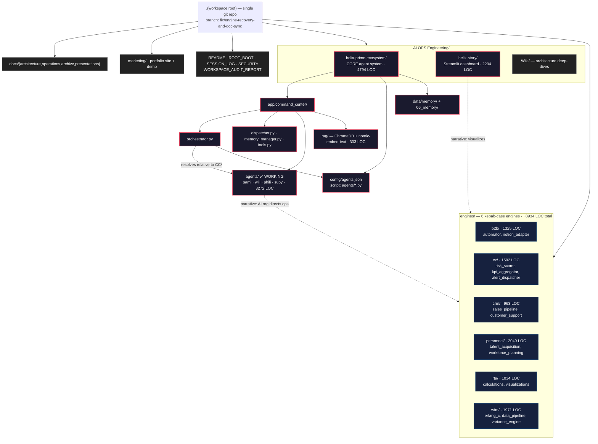
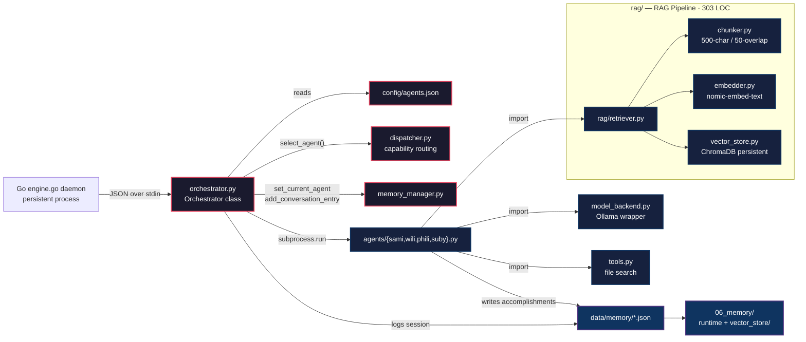
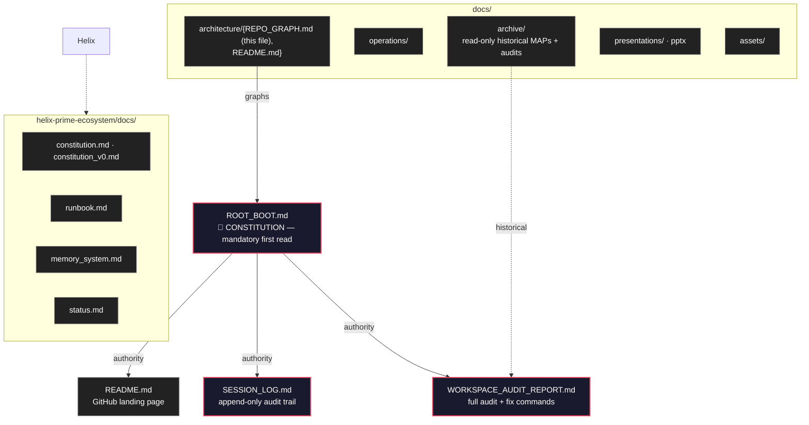
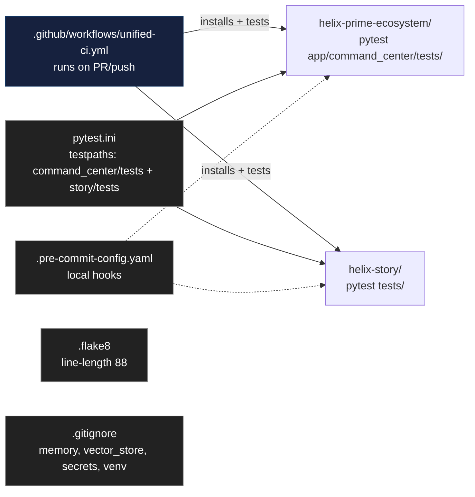

# Repository Graph — Helix Prime Ecosystem

> **Single source of truth for the workspace's physical structure and dependency topology.**
> Generated 2026-07-20 from live filesystem inspection. Author: **Hatem Shalaby**.
> Maintained alongside `ROOT_BOOT.md` (the constitution). When you move code, update both.

---

## How to read this graph

- **Solid arrows** = hard dependency (import, subprocess, registry path, config load).
- **Dashed arrows** = soft dependency (shared memory, deployment artifact, narrative link).
- LOC counts are Python only (`*.py`), excluding `__pycache__`, `.venv`, and tests unless noted.
- Constitution rule (from `ROOT_BOOT.md`): **kebab-case directories, no spaces in paths, single `.git` at root.**

---

## High-Level Workspace Graph



---

## Core Agent System — `helix-prime-ecosystem/app/command_center/`

This is the heart of the workspace. The orchestrator receives a JSON payload (from the Go daemon or directly via stdin), validates the requested agent against `config/agents.json`, logs context through `memory_manager`, then executes the agent script in an isolated subprocess.



### Agent registry contract

`config/agents.json` maps each agent name to a `script` path **relative to `app/command_center/`**:

```json
{
  "sami": { "script": "agents/sami.py", "capabilities": ["general_reasoning", "conversation", "strategy"], "status": "active" },
  "wili": { "script": "agents/wili.py", "capabilities": ["general_reasoning", "conversation", "learning"], "status": "active" },
  "phili": { "script": "agents/phili.py", "capabilities": ["general_reasoning", "conversation", "reflection"], "status": "active" },
  "suby": { "script": "agents/suby.py", "capabilities": ["general_reasoning", "conversation", "creation"], "status": "active" }
}
```

Resolution code (`orchestrator.py:106`): `agent_script = self.command_center_dir / script_value`.

> **Why this matters:** the script path is *not* relative to the workspace root. A previous audit mistakenly documented `agents/sami.py` as a broken root-path reference — it is correct. The working copies live in `app/command_center/agents/`, and the stale root `agents/` (which had broken `00_command_center` imports) was removed on 2026-07-20.

---

## Engines — `engines/{b2b,cx,crm,personnel,rta,wfm}/`

Six independently-runnable business modules. They do **not** import the command center — they are connected to the agent system only at the narrative level (the AI organization "directs" these engines). All internal references are relative (`src/`, `data/`).

```mermaid
flowchart TB
    subgraph WFM["engines/wfm/ · 1971 LOC"]
        WFMApp["src/app_wfm.py · 575L"]
        WFMErlang["src/erlang_c.py · 315L<br/>Erlang C staffing math"]
        WFMPipe["src/data_pipeline.py · 460L"]
        WFMVar["src/variance_engine.py · 621L"]
        WFMData["src/data/ · actuals.csv + sample_intervals.csv"]
        WFMOut["src/output/ · forecast_viz.png + results.json"]
        WFMApp --> WFMErlang
        WFMApp --> WFMPipe
        WFMApp --> WFMVar
        WFMPipe --> WFMData
        WFMApp --> WFMOut
    end

    subgraph RTA["engines/rta/ · 1034 LOC"]
        RTAApp["src/app.py · 240L"]
        RTACalc["src/calculations.py · 512L<br/>adherence math"]
        RTAVis["src/visualizations.py · 282L"]
        RTAApp --> RTACalc
        RTAApp --> RTAVis
    end

    subgraph CX["engines/cx/ · 1592 LOC"]
        CXRisk["src/risk_scorer.py · 563L<br/>4-KPI risk scoring"]
        CXKpi["src/kpi_aggregator.py · 361L"]
        CXAlert["src/alert_dispatcher.py · 271L"]
        CXSql["src/sql_extractor.py · 215L"]
        CXFeed["src/dashboard_feed.py · 182L"]
        CXConfig["config/risk_thresholds.yaml"]
        CXSqlViews["src/sql/ · v_client_{aht,csat,fcr,sla}_trend.sql"]
        CXKpi --> CXRisk
        CXRisk --> CXAlert
        CXFeed --> CXKpi
        CXSql --> CXKpi
        CXRisk -.-> CXConfig
    end

    subgraph B2B["engines/b2b/ · 1325 LOC"]
        B2BMain["src/main.py · 305L"]
        B2BAuto["src/automator.py · 497L<br/>SOP generation"]
        B2BNotion["notion_adapter/notion_adapter.py · 523L"]
        B2BMain --> B2BAuto
        B2BMain --> B2BNotion
    end

    subgraph PERS["engines/personnel/ · 2049 LOC"]
        PersMain["src/main.py · 465L"]
        PersPipe["src/pipeline_manager.py · 595L"]
        PersTalent["src/talent_acquisition.py · 472L"]
        PersWork["src/workforce_planning.py · 517L"]
        PersMain --> PersPipe
        PersMain --> PersTalent
        PersMain --> PersWork
    end

    subgraph CRM["engines/crm/ · 963 LOC"]
        CRMSales["src/sales_pipeline.py · 575L"]
        CRMSupport["src/customer_support.py · 388L"]
    end

    classDef wfm fill:#16213e,stroke:#0f3460,color:#fff
    classDef rta fill:#16213e,stroke:#0f3460,color:#fff
    classDef cx fill:#16213e,stroke:#0f3460,color:#fff
    classDef b2b fill:#16213e,stroke:#0f3460,color:#fff
    classDef pers fill:#16213e,stroke:#0f3460,color:#fff
    classDef crm fill:#16213e,stroke:#0f3460,color:#fff
    class WFMApp,WFMErlang,WFMPipe,WFMVar,WFMData,WFMOut wfm
    class RTAApp,RTACalc,RTAVis rta
    class CXRisk,CXKpi,CXAlert,CXSql,CXFeed,CXConfig,CXSqlViews cx
    class B2BMain,B2BAuto,B2BNotion b2b
    class PersMain,PersPipe,PersTalent,PersWork pers
    class CRMSales,CRMSupport crm
```



### Engine migration history (2026-07-20)

All 6 engines were relocated from spaced-name directories to kebab-case targets under `engines/`:

| Original (spaced, constitution violation) | Target (kebab-case) | LOC moved |
|-------------------------------------------|---------------------|-----------|
| `WFM FORECASTING CALCULATOR/` | `engines/wfm/` | 1971 |
| `RTA COMMAND CENTER/` | `engines/rta/` | 1034 |
| `CX SENTIMENT & CHURN SENTINEL/` | `engines/cx/` | 1592 |
| `B2B_Client_Onboarding_Automator/` | `engines/b2b/` | 1325 |
| `Personnel Engine/` | `engines/personnel/` | 2049 |
| `CRM_Layer/` | `engines/crm/` | 963 |
| **Total** | | **~8934** |

No live code, CI, Docker, or config referenced the old paths — the relocation was verified safe before execution.

---

## Documentation & Operations Graph



---

## CI/CD & Tooling



---

## Summary Metrics (2026-07-20)

| Layer | LOC (Python) | Status |
|-------|--------------|--------|
| Core agent system (`command_center/`) | 4794 | ✅ Working |
| — Agent implementations (`agents/`) | 3272 | ✅ Working |
| — RAG pipeline (`rag/`) | 303 | ✅ Working |
| — Test suite (`tests/`) | 467 | ✅ Passing (see `pytest.ini`) |
| Engines (6 total) | 8934 | ✅ Relocated, independently runnable |
| Dashboard (`helix-story/`) | 2204 | ✅ Working |
| **Total Python (excl. venv)** | **~16400** | |

### Directory naming compliance
- ✅ All directories kebab-case (zero spaces in any tracked path).
- ✅ Single `.git` at workspace root.
- ✅ No duplicate projects (Helix Prime CEO deleted; stale root `agents/` removed 2026-07-20).

### Memory layers
- **JSON layer:** `helix-prime-ecosystem/data/memory/*.json` (7 files) + `06_memory/` runtime.
- **Vector layer:** `06_memory/vector_store/` — ChromaDB persistent, `helix_memory` collection, nomic-embed-text embeddings.
- **Both are gitignored** (constitution: never commit memory or vector stores).
